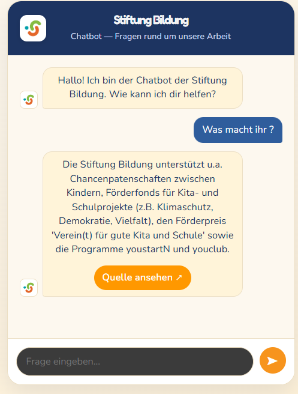

# Stiftung Bildung Chatbot

Dieses Projekt ist ein einfacher Chatbot für die Stiftung Bildung. Das Frontend stellt eine Chat-Oberfläche bereit, das Backend beantwortet Fragen anhand einer lokalen Wissensbasis (`knowledgeBase.json`).

Der aktuelle Stand ist ein regelbasierter Prototyp: Es wird keine KI-API verwendet. Stattdessen sucht das Backend nach passenden Schlüsselwörtern in der Wissensbasis und gibt die beste Antwort mit Quelle und optionaler Kontaktadresse zurück.

## Vorschau



## Funktionen

- Chat-Oberfläche mit Startnachricht, Eingabefeld und Ladeanzeige
- Stiftung-Bildung-Logo im Header und als Bot-Avatar
- Senden per Button oder Enter-Taste
- Kommunikation vom Frontend zum Backend über `POST http://localhost:3001/chat`
- Keyword-Matching im Backend mit einfacher Bewertung der Treffer
- Fallback-Antwort, wenn keine passende Information gefunden wird
- Anzeige von Quellenlinks und Kontakt-E-Mail-Adressen
- Testskript für typische Fragen aus der Wissensbasis

## Projektstruktur

```text
stiftung-chatbot/
|-- backend/
|   |-- knowledgeBase.json
|   |-- package.json
|   |-- package-lock.json
|   |-- server.ts
|   |-- test.ts
|   |-- testQuestions.json
|   `-- tsconfig.json
`-- frontend/
    |-- public/
    |   |-- favicon.svg
    |   `-- icons.svg
    |-- src/
    |   |-- assets/
    |   |   |-- Chatbot_Prototyp.png
    |   |   |-- hero.png
    |   |   |-- Logo-Stiftung-Bildung-Bildmarke_quadratisch_RGB.png
    |   |   |-- react.svg
    |   |   `-- vite.svg
    |   |-- App.css
    |   |-- App.tsx
    |   |-- index.css
    |   `-- main.tsx
    |-- eslint.config.js
    |-- index.html
    |-- package.json
    |-- package-lock.json
    |-- tsconfig.app.json
    |-- tsconfig.json
    |-- tsconfig.node.json
    `-- vite.config.ts
```

## Was die Dateien tun

### Backend

- `backend/server.ts`: Startet den Express-Server auf Port `3001`, aktiviert CORS und JSON-Parsing, nimmt Chat-Anfragen unter `/chat` entgegen und sucht die beste Antwort in der Wissensbasis.
- `backend/knowledgeBase.json`: Enthält die Antworten des Chatbots. Jeder Eintrag besteht aus Keywords, Kategorie, Antworttext, Quelle und optional einer Kontaktadresse.
- `backend/test.ts`: Führt Testfragen aus und prüft, ob die jeweils erwartete Quelle gefunden wird.
- `backend/testQuestions.json`: Sammlung von Testfragen mit erwarteter Quelle.
- `backend/package.json`: Definiert Backend-Abhängigkeiten und Skripte wie `dev`, `build`, `start` und `test`.
- `backend/tsconfig.json`: TypeScript-Konfiguration für das Backend.
- `backend/package-lock.json`: Fixiert die installierten npm-Versionen.

### Frontend

- `frontend/src/App.tsx`: Hauptkomponente der Chat-App. Verwaltet Nachrichten, Eingabe, Ladezustand, automatisches Scrollen und ruft das Backend auf.
- `frontend/src/App.css`: Styling für Chatkarte, Nachrichtenblasen, Header, Eingabebereich, Ladepunkte und mobile Ansicht.
- `frontend/src/main.tsx`: Einstiegspunkt der React-App. Rendert `App` in das HTML-Element `#root`.
- `frontend/src/index.css`: Globale Basisstyles für die Vite/React-Anwendung.
- `frontend/src/assets/`: Bild- und SVG-Dateien für das Frontend, darunter das Stiftung-Bildung-Logo und der Screenshot des Prototyps.
- `frontend/public/favicon.svg`: Browser-Icon der Anwendung.
- `frontend/public/icons.svg`: Öffentliche Icon-Datei.
- `frontend/index.html`: HTML-Grundgerüst, in das die React-App geladen wird.
- `frontend/vite.config.ts`: Vite-Konfiguration mit React-Plugin.
- `frontend/eslint.config.js`: ESLint-Konfiguration für Code-Checks.
- `frontend/package.json`: Definiert Frontend-Abhängigkeiten und Skripte wie `dev`, `build`, `lint` und `preview`.
- `frontend/tsconfig*.json`: TypeScript-Konfigurationen für App, Node/Vite und das Gesamtprojekt.
- `frontend/package-lock.json`: Fixiert die installierten npm-Versionen.

## Installation

Die Abhängigkeiten liegen getrennt in `backend` und `frontend`.

```bash
cd backend
npm install

cd ../frontend
npm install
```

## Entwicklung starten

Zuerst das Backend starten:

```bash
cd backend
npm run dev
```

Danach in einem zweiten Terminal das Frontend starten:

```bash
cd frontend
npm run dev
```

Das Backend läuft standardmäßig auf:

```text
http://localhost:3001
```

Das Frontend wird von Vite gestartet. Die genaue URL steht nach dem Start im Terminal, typischerweise:

```text
http://localhost:5173
```

## Tests

Die Backend-Tests prüfen, ob Beispiel-Fragen zur richtigen Quelle aus der Wissensbasis führen.

```bash
cd backend
npm test
```

## Build

Backend bauen:

```bash
cd backend
npm run build
```

Frontend bauen:

```bash
cd frontend
npm run build
```

## Hinweise zum aktuellen Stand

- Die Antworten sind nur so gut wie die Einträge in `backend/knowledgeBase.json`.
- Neue Themen können durch neue Einträge mit passenden Keywords ergänzt werden.
- Das Matching ist absichtlich einfach gehalten und basiert auf exakten Wort- oder Phrasentreffern.
